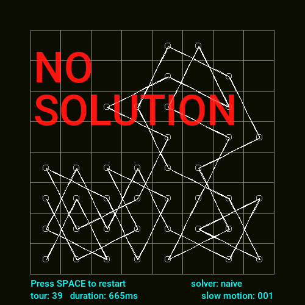
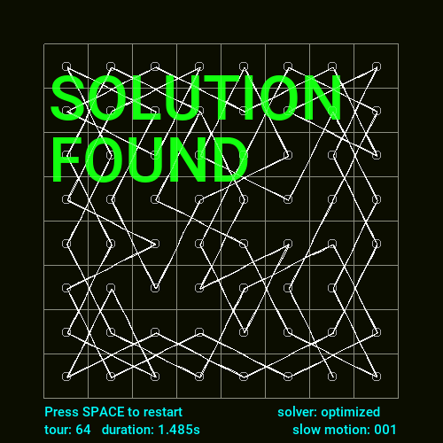

# go-knight-tour

Golang simulation of [knight's tour](https://en.wikipedia.org/wiki/Knight%27s_tour), a sequence of moves of a knight on a chessboard such that the knight visits every square exactly once.

## Usage

```sh
Usage of knight:
  -d    debug (default is false)
  -i string
        implementation (default is "naive") (default "naive")
  -s int
        slowMotion resolution (default is 1) (default 1)
```

**Available implementations (see below)**
* naive
* backtracking
* optimized

**Speed**
* ⬆ key reduces display speed
* ⬇ key increases display speed

**Screenshots**
* `s` key captures screen

## Solving Knight Tour Problem

### First naive implementation



* *Random move: no strategy for moves*,
* *Implementation: simple recursive implementation*,
* **Result**: reaches blocking situation before solving the problem

```sh
go run cmd/knight/main.go -s 20 -i naive
```

### Backtracking


* *Random move: no strategy for moves*,
* **Backtracking: examin each move and go back in history to try another branch if reaches a blocking situation**
* **Result**: algorithm can't find any solution fast enough

```sh
go run cmd/knight/main.go -s 0 -i backtracking
```

### Optimized



This algorithm implements the [Warnsdorf's rule](https://en.wikipedia.org/wiki/Knight%27s_tour#Warnsdorf's_rule).

* **Consider moving in prority toward cells with minimal access**,
* Backtracking: examin each move and go back in history to try another branch if reaches a blocking situation
* **Result**: super fast solution found

```sh
go run cmd/knight/main.go -s 0 -i optimized
```

### 2D game engine

* [Ebiten](https://github.com/hajimehoshi/ebiten/v2)

### Design

* [Hand drawn lines](https://shihn.ca/posts/2020/roughjs-algorithms/)

## Todo

* [ ] Export handdrawn line as a separate library (remove init, make a struct)
* [ ] Try to solve noise and agitation due to randomness recomputed every tick
* [ ] Offer an option to chose line design
* [ ] Detect Hamiltonian closed graphs
* [ ] Fill a cell over two with a color (like a chess board)